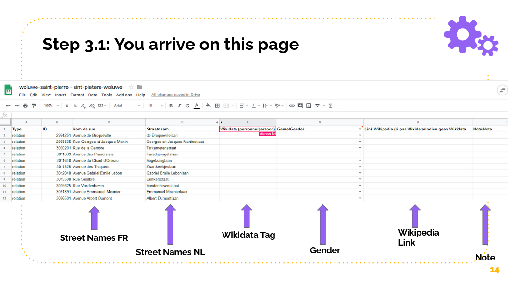
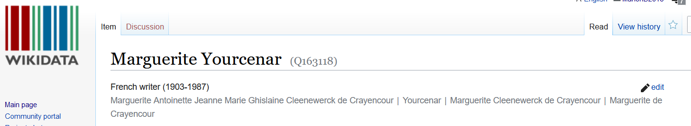
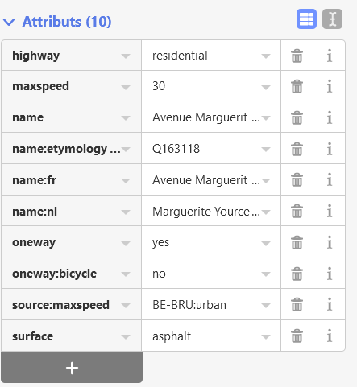
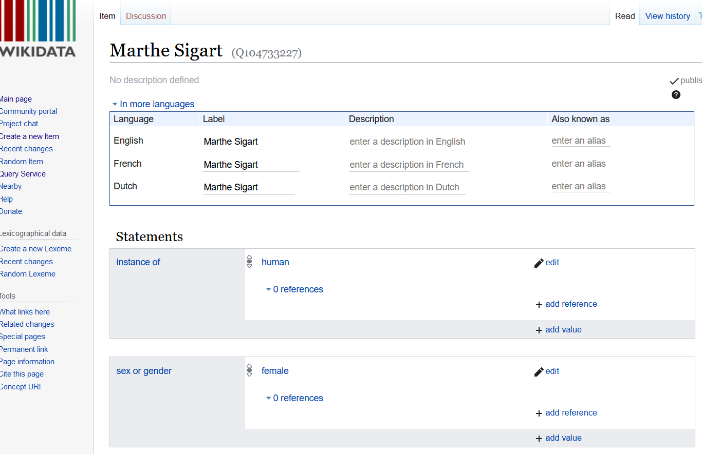

# 2. Community event

## 🔊Announce the event 

Announce the community event to find volunteers at least 6 weeks before the event. You can use the copy written by EqualStreetNames.Brussels as a basis \(link [here\)](https://fb.me/e/blSrhxXsz). 

**A few information about the event organized on 17/02/2020 in Brussels:** 

* 18h30 - 22h
* 80 volunteers 
* Total of 5500 streets.

## 🥅Goals

As mentioned before, the ultimate goal of the project is to link the data from **Wikidata** - where the information about gender is stored - to **OpenStreetMap,** which is how we can visualize the information. Concretely, this means that the participants' mission will be to associate the name of the street \(when attributed to a person\) to the Wikidata Tag. 

### **Case 1: Wikidata Tag already exists**

**Name of the street:** Rue Marguerite Yourcenar

**Step 1:** Go to the .CSV file. You will have to add the columns on the right side: 

* **Wikidata of the person** \(attention, not the wikidata tag of the streetname - there are two different things!\) 
* **Gender:** the gender will be recorded in the wikidata tag. However, it is a good practice to ask the participants to add as a backup. 
* **Link to Wikipedia:** many names will not have a wikidata tag. Ask the participants to add the wikipedia page link. This will help you when you will add the wikidata later on. Alternatively, you can also ask the participants to add the wikidata tag. 
* **Notes :** it's possible that someone won't have a wikidata or wikipedia. Ask the participant to write a note there.

**Step 3:** Search Wikidata 

**Step 4:** Add the Wikidata Tag to the .CSV file 

**Step 5:** Add the Wikidata Tag to OpenStreetMap. 

* Step 5.1: Create an account on OpenStreetMap 
* Step 5.2: Search the street on OpenStreetMap
* Step 5.3: Click Edit \(top left\) 
* Step 5.4: In attributes, add name:etymology and then the Wikidata tag \(Q\)

### **Case 2: Wikidata Tag doesn't exist** 

**Street Name:** Rue Marthe Sigart \(Mons, Belgium\)

* Step 1: Search Wikidata to see if there's a tag. 
* Step 2: If no tag, search Wikipedia - is there a profile already that will give you information about the person? 
* Step 3: Create the wikidata tag 
  * Add description in English, French & Dutch in first box 
  * Add the following statements: 
    * Instance of: "human" 
    * Sex of Gender

## 🍳Preparation

Prepare the presentation to explain the process to the participants. You can reuse the below presentation.

If your event can be organized offline, don't forget a bit of food & drinks - it sure helps to focus!



## 🏃‍♀️Follow-up

When the event is finish, send an emai to the participants to thank them for having contributed to a more equal world & ask them to share the map when it's published.

