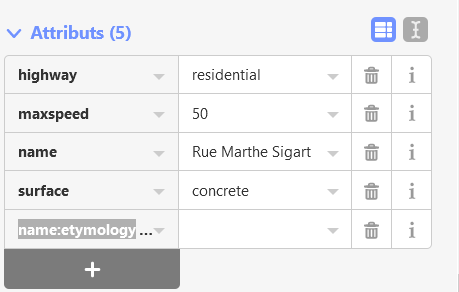
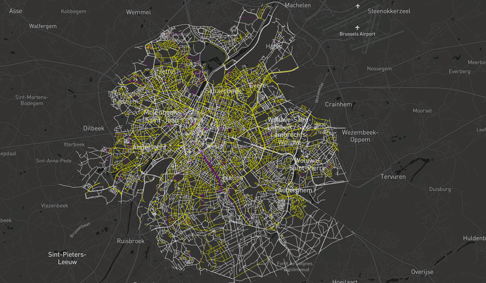

# 3. Wikidata Tags to OpenStreetMap

Now that you have found or created a new wikidata tag for the person behind the street name, the last step is to add the wikidata tag to OpenStreetMap. We promise, it's not hard! 

### Let's use the example of _Marthe Sigart_ again 

We just created a Wikidata Tag for her: Q104733227. 

**Step 1:** Search the street in OpenStreetMap 

**Step 2:** Click on editing \(make sure you are logged in on OSM\)

**Step 3**: Click on the + below attributes and add **name:etymology:wikidata**

**Step 4:** Save \(top right of your screen\), add a comment \("add wikidata tag\) and publish!

**Step 5:** Go back to OpenStreetMap. Yes, your wikidata tag is there!

**!!!Attention!!! On OpenStreetMap, some streets are published in different sections. Therefore, you will need to do this action the amount of time than the amounts of sections.** 

When all the wikidata tags have been added to OpenStreetMap, ask your technical lead to run the script to update the platform. This is it, you are done! Bravo! 👏👏👏

